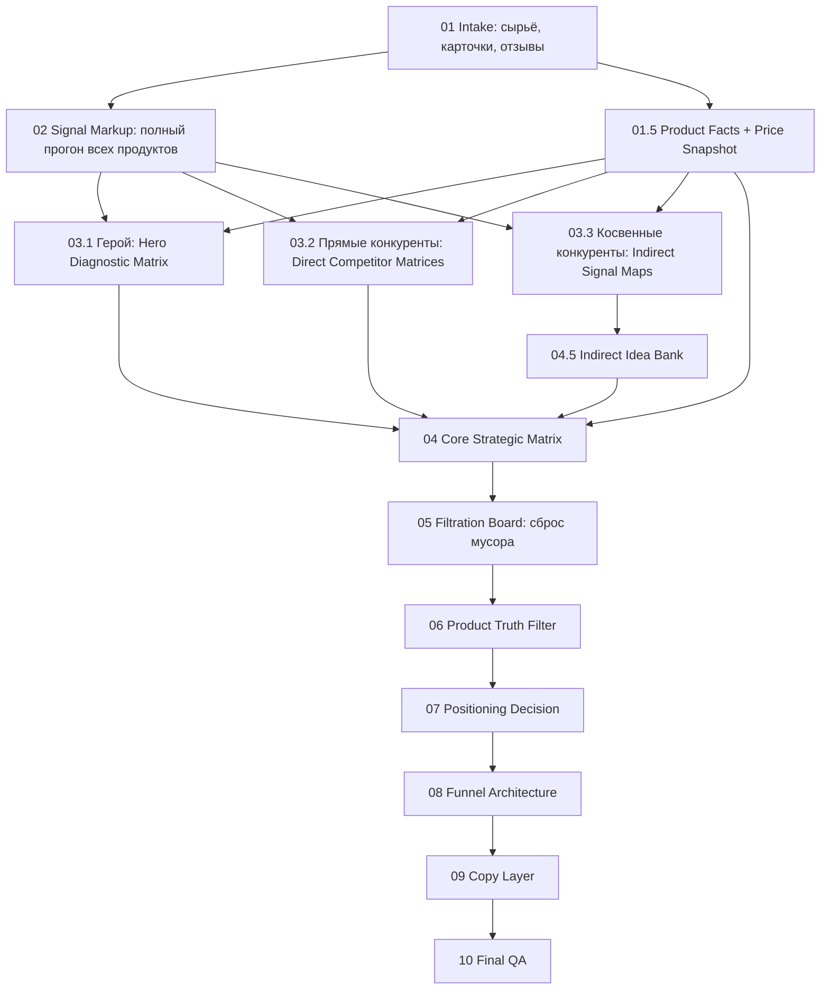

# Full Markup Branching Pipeline

Статус: архивный расширенный черновик.

```text
не использовать как активный маршрут
активный маршрут сейчас:
02_routing/READY_PIPELINE_01_05_RU.md
02_routing/READY_PIPELINE_06_07_RU.md
00_navigation/CANONICAL_NAMING_AND_FOLDER_MAP.md
```

Исторический статус: рабочий маршрут после решения не сжимать конкурентные отзывы на входе.

Главное решение:

все продукты, которые участвуют в исследовании, проходят полный `Signal Markup`.

Экономим не на первичной разметке.

Экономим на следующем этапе: специалисты быстро отсеивают мусор, паритет, слабые гипотезы и не дают каждому сигналу превратиться в большой документ.

Главный фокус:

```text
мы не ищем объективную правду о продукте
мы анализируем, что покупатель увидит в отзывах и где он отвалится
```

См. `../01_core_focus/CORE_FOCUS_REVIEW_READER.md`.

---

## 1. Почему Выбрали Full Markup

Причина:

если сжимать конкурентов до того, как материал увидит маркетолог / стратег, можно потерять редкие, но сильные сигналы.

Риск компрессии:

- AI решает, что важно, до специалиста;
- редкие сигналы не попадают в выборку;
- маркетолог потом просит развернуть отзывы обратно;
- экономия времени исчезает;
- доверие к базе падает.

Решение:

```text
все важные продукты -> полный signal markup
после markup -> строгая фильтрация специалистами
```

---

## 2. Общая Схема



---

## 3. Этап 01: Intake

### Что делаем

Собираем все продукты в проекте:

- герой;
- прямые конкуренты;
- косвенные конкуренты.

### Кто работает

Специалист не нужен.

Это регистрация и раскладка сырья.

### Выход

`01__project__intake_map.md`

В нём должно быть:

```text
hero:
direct_competitors:
indirect_competitors:
raw_review_sources:
card_sources:
missing_materials:
```

---

## 3.5. Этап 01.5: Product Facts And Price Snapshot

### Что делаем

Быстро фиксируем факты продукта и цену до анализа отзывов:

- описание селлера;
- обещания селлера;
- характеристики;
- вес / объём / количество;
- цены героя и конкурентов;
- объём / цену за единицу;
- рейтинг и количество отзывов.

### Кто работает

Это подготовительная ветка.

Финальные специалисты ещё не выбирают стратегию.

Пользователь даёт факты карточки, AI структурирует.

### Выходы

```text
01_intake/product_passports/{role}/{product_key}/01__product_key__product_passport.md
01_intake/01__project__price_value_snapshot.md
```

### Как собираем быстро

Основной вариант:

```text
скриншоты + скопированный текст описания / характеристик + короткие поля: цена, объём, рейтинг, число отзывов, ссылка + голосовые claims с картинок
```

Не делаем ручной паспорт, если он начинает съедать время.

Критику карточек и выдачи не используем до 4 этапа.

Она относится к этапу 4 как человеческий слой восприятия рынка и дальше может помогать стратегии / воронке.

Подробный метод:

```text
00_project/04_methods/PRODUCT_FACTS_PRICE_AND_DEFERRED_CARD_CRITIQUE_METHOD.md
```

---

## 4. Этап 02: Full Signal Markup

### Что делаем

Полностью размечаем отзывы каждого продукта.

### Кто работает

`AI-разметчик`

`Контролёр доказательности` проверяет результат.

### Что важно

AI не принимает стратегических решений.

Он только превращает отзывы в стабильную разметку:

- позитив;
- негатив;
- ожидание;
- сомнение;
- сравнение;
- сценарий;
- manual queue;
- trash.

### Выходы

```text
02_signal_markup/hero/02__hero_key__signal_markup.md
02_signal_markup/direct_competitors/02__competitor_key__signal_markup.md
02_signal_markup/indirect_competitors/02__competitor_key__signal_markup.md
```

---

## 5. Этап 03.1: Hero Diagnostic Matrix

### Что делаем

Герой разбирается максимально глубоко, но не ради "правды о продукте".

Цель:

понять, какие видимые в отзывах минусы станут стоп-факторами, для кого они критичны, для кого терпимы, и какие позитивные сигналы / сценарии помогают покупателю не отвалиться.

### Кто работает

- `Диагност отзывов`
- `Поведенческий экономист`
- `Контролёр продуктовой честности`
- `Контролёр доказательности`

### Что выходит

`03_hero_diagnosis/03__hero_key__diagnostic_matrix.md`

Матрица героя строится только по сигналам героя:

```text
observed_signal_group
signal_base
visible_minus_or_risk
stop_for
tolerable_for
scenario_or_expectation
stop_factor
possible_deal
evidence_ids
status
```

### Запрещено

- добавлять прямого конкурента как факт героя;
- добавлять косвенного конкурента как факт героя;
- выбирать позиционирование;
- писать карточку.

---

## 6. Этап 03.2: Direct Competitor Matrices

### Что делаем

Прямые конкуренты проходят полный signal markup, а затем получают не такой же глубокий отчёт, как герой, а рабочую матрицу для сравнения.

### Кто работает

- `Аналитик конкурентов`
- `Маркетплейс-стратег`
- `Контролёр доказательности`

### Что выходит по каждому конкуренту

`03_competitors/direct/03__competitor_key__direct_matrix.md`

Формат:

```text
competitor:
source_signal_markup:

market_deals:
  - deal:
    signal_base:
    tolerated_minus:
    breaking_minus:
    scenario_or_expectation:
    useful_language:
    evidence_ids:

market_stop_factors:
market_parity_signals:
what_to_check_in_hero:
```

### Зачем это нужно

Прямые конкуренты помогают понять:

- что является нормой категории;
- какие минусы рынок терпит;
- какие минусы рынок не терпит;
- какие сценарии повторяются у похожих товаров;
- где герой сильнее / слабее.

### Запрещено

- делать конкурента вторым героем;
- напрямую переносить его сделку в героя;
- считать чужой сигнал доказательством героя.

---

## 7. Этап 03.3: Indirect Signal Maps

### Что делаем

Косвенные конкуренты тоже размечены полноценно, но их сигналы не добавляются напрямую в матрицу героя.

### Кто работает

- `Аналитик конкурентов`
- `Креативный стратег`
- `Маркетплейс-стратег`
- `Контролёр доказательности`

### Что выходит

`03_competitors/indirect/03__competitor_key__indirect_signal_map.md`

Формат:

```text
competitor:
type: indirect
source_signal_markup:

signals_worth_noticing:
scenario_patterns:
expectation_patterns:
comparison_language:
creative_angle_hints:
risk_hints:
what_to_check_in_hero:
evidence_ids:
```

### Зачем это нужно

Косвенные конкуренты дают:

- язык;
- сценарии;
- соседние ожидания;
- неожиданные углы;
- идеи для проверки.

### Запрещено

- добавлять косвенный сигнал в матрицу героя как факт;
- использовать косвенного конкурента как доказательство;
- делать из косвенного угла стратегию без проверки у героя.

---

## 8. Этап 04: Core Strategic Matrix

### Что делаем

Собираем одну большую рабочую матрицу.

Но у неё разные зоны доказательности.

### Кто работает

- `Маркетплейс-стратег`
- `Диагност отзывов`
- `Поведенческий экономист`
- `Контролёр доказательности`

### Структура матрицы

```text
ZONE A: Hero Observed Deals
  Только то, что доказано у героя.

ZONE B: Direct Market Additions
  То, что видно у прямых конкурентов и нужно проверить / сопоставить с героем.

ZONE C: Market Norms
  То, что повторяется у прямых конкурентов и, вероятно, является паритетом категории.

ZONE D: Indirect Idea Bank
  То, что пришло от косвенных конкурентов как язык / сценарий / идея.

ZONE E: Rejected / Noise
  То, что отсеяно.
```

### Важное правило

Косвенные конкуренты не добавляются прямо в ядро матрицы героя.

Они добавляются в `Indirect Idea Bank` с низшим статусом доказательности.

### Статусы строк

```text
confirmed_in_hero
weak_trace_in_hero
direct_market_norm
direct_market_hypothesis
indirect_language_idea
indirect_scenario_idea
rejected_noise
rejected_by_product_truth
```

### Выход

`04_market_context/04__core_strategic_matrix.md`

---

## 9. Этап 05: Filtration Board

### Что делаем

Это этап сброса мусора.

После полной разметки материалов будет много сигналов, и не все должны идти дальше.

### Кто работает

- `Маркетплейс-стратег`
- `Поведенческий экономист`
- `Контролёр продуктовой честности`
- `Контролёр доказательности`

### Что фильтруем

1. Дубли.
2. Слабые единичные сигналы без стратегического смысла.
3. Паритет, который нельзя продавать как отличие.
4. Косвенные идеи, которые не держит герой.
5. Противоречия product truth.
6. Красивые, но пустые интерпретации.
7. Сигналы, которые не влияют на выбор покупателя.

### Что нельзя фильтровать автоматически

- редкие сильные сигналы;
- негативы;
- стоп-факторы;
- странные сравнения;
- неожиданные сценарии;
- сигналы упаковки / доставки, если они ломают сценарий покупки.

### Выход

`04_market_context/05__filtration_board.md`

В нём должны быть списки:

```text
keep_for_strategy:
keep_as_support:
keep_as_risk:
idea_bank_only:
archive:
reject:
```

---

## 10. Этап 06: Product Truth Filter

### Что делаем

Проверяем, какие строки из отфильтрованной матрицы можно использовать честно.

### Кто работает

- `Контролёр продуктовой честности`
- `Контролёр доказательности`
- `Маркетплейс-стратег`

### Выход

`05_strategy/06__product_truth_filter.md`

Статусы:

```text
can_claim
can_support
can_test_carefully
cannot_claim
```

---

## 11. Этап 07: Positioning Decision

### Что делаем

Выбираем одну главную ставку.

### Кто работает

- `Руководитель позиционирования`
- `Маркетплейс-стратег`
- `Поведенческий экономист`
- `Контролёр доказательности`

### Выход

`05_strategy/07__positioning_decision.md`

---

## 12. Этап 08: Архитектура воронки

### Что делаем

Разводим выбранную ставку по слайдам.

### Кто работает

- `Архитектор воронки`
- `Маркетплейс-стратег`
- `Поведенческий экономист`

### Выход

`06_funnel/08__funnel_architecture.md`

---

## 13. Этап 09: Copy Layer

### Что делаем

Пишем тексты по утверждённой воронке.

### Кто работает

- `Копирайтер`
- `Контролёр доказательности`
- `Маркетплейс-стратег`

### Выход

`07_copy/09__copy_layer.md`

---

## 14. Этап 10: Final QA

### Что делаем

Финальная проверка:

- не предали ли данные;
- не усилили ли обещания;
- не смешали ли героя с конкурентами;
- не протащили ли косвенную идею как доказательство;
- не оставили ли мусор в стратегии.

### Кто работает

- `Контролёр доказательности`
- `Контролёр продуктовой честности`
- `Маркетплейс-стратег`
- `Визуальный стратег`, если есть визуал.

### Выход

`08_qa/10__final_review.md`

---

## 15. Главная Логика Дальше

Коротко:

```text
Разметить всё полно.
Развести по веткам.
Собрать ядро героя.
Сопоставить прямых конкурентов.
Косвенных держать в idea bank.
Собрать большую матрицу со статусами доказательности.
Жёстко отфильтровать мусор.
Только потом выбирать стратегию.
```

---

## 16. Почему Это Не Раздувает Проект

Потому что раздувание переносится не на разметку, а на решение.

Полная разметка создаёт сырьё.

Фильтрация не даёт всему сырью стать стратегией.

Главный принцип:

```text
широкий вход
строгий выход
```

И ещё один принцип:

```text
не правда о продукте
а восприятие отзывов покупателем
```
# Full Markup Branching Pipeline

Статус: архивный расширенный черновик.

```text
не использовать как активный маршрут
активный маршрут сейчас:
02_routing/READY_PIPELINE_01_05_RU.md
02_routing/READY_PIPELINE_06_07_RU.md
00_navigation/CANONICAL_NAMING_AND_FOLDER_MAP.md
```
